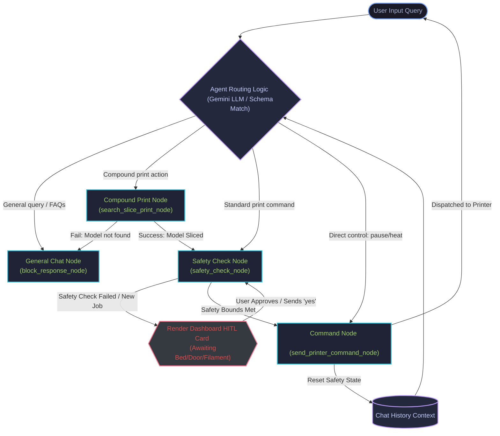

# BamBot Agent Architecture (State Graph Workflow)

The diagram below details the internal state machine graph of the **BamBot Agent** defined in `app/agent.py`. It shows how incoming user messages are routed between search, slicing, safety evaluations, and command execution states.

## Detailed Node Functions

### 1. Agent Routing Logic
*   **Context Evaluation**: Inspects the incoming prompt alongside the session's chat history.
*   **Action Mapping**: Evaluates the schema definitions to map queries to registered tools or state nodes. Short answers (like "yes", "sure", "cancel") are matched against the previous agent turn in the history to proceed with the pending action.

### 2. General Chat Node (`block_response_node`)
*   Provides standard conversation outputs, general explanations, and FAQ troubleshooting tips.
*   Optionally calls the `query_3d_printing_knowledge` MCP tool to search the local troubleshooting directory.

### 3. Compound Print Node (`search_slice_print_node`)
*   Runs a multi-step pipeline inside a single turn:
    1.  **Search**: Queries `search_3d_models` to locate candidate files.
    2.  **Download**: Automatically triggers `download_3d_model` using the matched model ID.
    3.  **Slicing**: Executes the `slice_model_file` MCP tool to invoke OrcaSlicer on the downloaded file.
*   If any stage fails, it redirects to the `block_response_node` to output the exact error (e.g. Slicer presets missing). If it succeeds, it automatically forwards the resulting `.gcode.3mf` filename to the `safety_check_node`.

### 4. Safety Check Node (`safety_check_node`)
*   **Approval Reset**: Automatically resets the session-scoped safety values (`bed_cleared`, `door_closed`) on every fresh print query to guarantee safety checks cannot be bypassed.
*   **Verification Check**: Checks the physical status of the chamber door (closed status is enforced if printing high-temp materials like ABS/ASA) and bed clearance.
*   **HITL Interrupt**: If safety conditions are not verified, it stops graph execution, suspends the print command, and yields an interrupt event to the frontend to render the interactive safety checklist card.

### 5. Command Node (`send_printer_command_node`)
*   Invokes the `send_printer_command` MCP tool to communicate with the BamBuddy API (e.g., executing `start_print`).
*   **Reset Hook**: Once a print command successfully executes, it immediately clears the safety verification status, requiring any subsequent print job to complete a new safety check.
