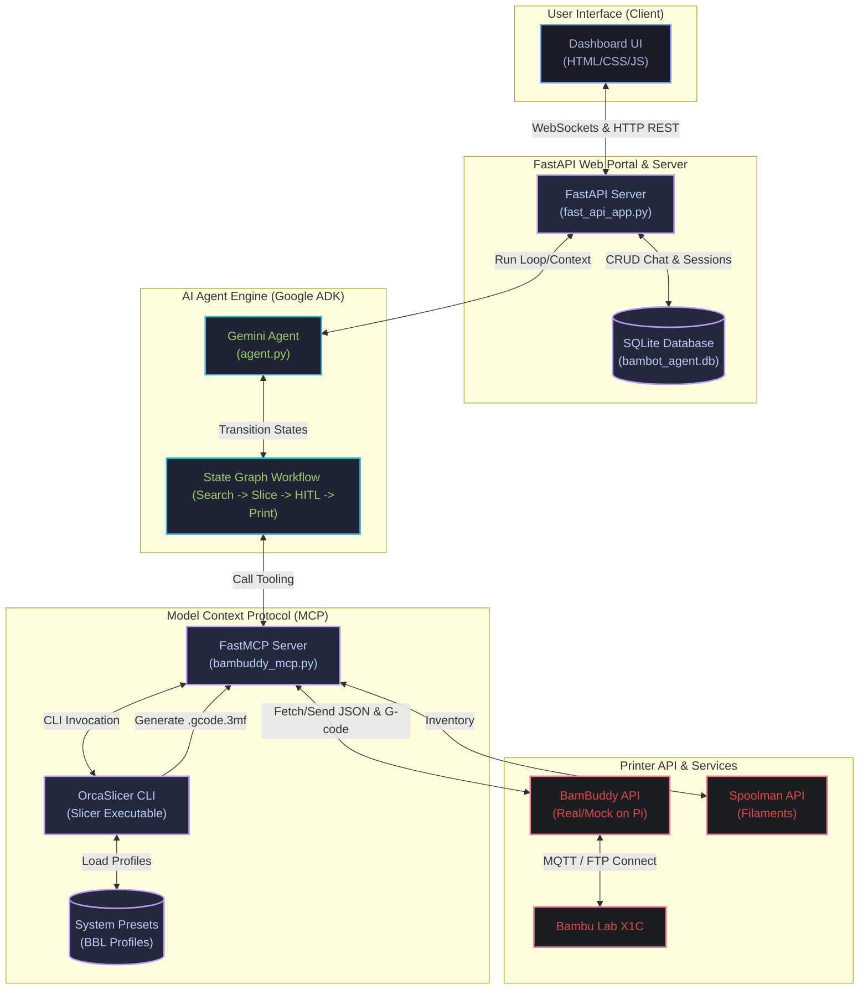

# BamBot Architecture Overview

The following diagram illustrates the relationship between the BamBot Agent, the FastAPI Web Dashboard, the Gemini-powered ADK workflow engine, the Model Context Protocol (MCP) server, OrcaSlicer, and the physical printer API interfaces.

## Component Details

### 1. Dashboard UI (Frontend)
*   **Web Portal**: Styled with a dark glassmorphic theme. Displays live telemetry (temps, print progress), active chat sidebar (multi-session history), active agent decision logs, and human-in-the-loop (HITL) prompt forms.
*   **Real-time Communication**: Links to the backend via REST for managing sessions and WebSockets for active chat execution and live telemetry updates.

### 2. FastAPI Backend
*   **Session Management**: Stores chat messages, active sessions, and printer telemetry logs inside `bambot_agent.db`.
*   **Agent Execution**: Hosts the Google ADK runner in a thread pool, managing execution context and passing messages back to the WebSocket connection.

### 3. AI Agent (Google ADK & Gemini)
*   **Workflow Graph**: Configures a directed state graph containing:
    *   `search_slice_print_node`: Chain-executes search, downloads, and slicing parameters.
    *   `safety_check_node`: Evaluates printer state and triggers the HITL safety confirmation card.
    *   `send_printer_command_node`: Directly dispatches commands after confirmation is approved.
*   **Dynamic Context Engine**: Evaluates conversation logs to parse follow-ups (e.g. "yes", "go ahead") and map appropriate model IDs or file targets.

### 4. FastMCP Server
*   **Encapsulated Tools**: Exposes direct Python operations as standard MCP tools (`get_printer_status`, `slice_model_file`, `download_3d_model`).
*   **OrcaSlicer Pipeline**: Launches the OrcaSlicer executable dynamically with loaded BBL system profiles (`.json`) to generate `.gcode.3mf` zip container prints.

### 5. Printer & Services Layer
*   **BamBuddy**: Acts as the printer-connected controller interface. Communicates directly with the printer hardware via FTP and local MQTT connections.
*   **Spoolman**: Serves as the database interface tracking materials and filament weights.
